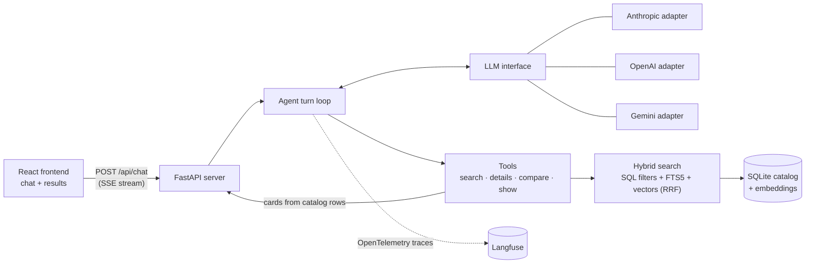

# AI Shopping Assistant

[](https://github.com/kumaranupam-personal/ai_shopping_assistant/actions/workflows/ci.yml)

A conversational shopping agent. Describe what you want in plain English or Hinglish ("garam jacket chahiye, 8k tak"), and the agent searches the catalog, shows matching products as cards, and refines the results as the conversation goes on.

<!-- TODO: add a demo GIF here (the example conversation: Ladakh jacket → "only waterproof" → "compare the first two" → "aur sasta dikhao") -->

```
You:   I'm going trekking in Ladakh in December, need a jacket under 8k, size L.
Agent: [searches jackets ≤ ₹8,000, size L, "warm jacket for high-altitude winter trekking"] → shows 6 cards
You:   only waterproof ones
Agent: [repeats the search with waterproof added] → shows new cards
You:   compare the first two
Agent: [compares the first two products it showed] → summarizes the differences
You:   aur sasta dikhao
Agent: [lowers the budget below the cheapest shown] → new cards, reply in Hinglish
```

## Highlights

- **Provider-agnostic agent.** One tool-calling loop runs on Anthropic, OpenAI or Gemini, chosen by a config variable. Each provider sits behind a small adapter, and only adapters may import a provider SDK (a test enforces this).
- **Grounded by design.** The model picks *which* products to show; product cards are built on the server from catalog rows, never from model text. An eval check flags any price or product the model mentions that no tool returned.
- **Hybrid search.** SQL filters for hard constraints, then SQLite FTS5 keyword ranking and vector similarity, merged with reciprocal rank fusion and capped at 3 products per brand. About 12 ms per search over the 2,400-product demo catalog.
- **Measured, not guessed.** A 20-case eval suite scores pass rate, grounding violations, latency, cost and prompt-cache hits for each provider. Prompt changes were tuned against it (see [Evaluation](#evaluation)).
- **Traced end to end.** Every turn is an OpenTelemetry trace in Langfuse: one span per model call (tokens, cache reads and writes, cost) and per tool call, grouped by conversation. The code uses only OpenTelemetry, so any OTLP backend works, and message text stays out of traces unless switched on.
- **Robust turns.** Each turn commits or rolls back as a unit: a provider failure, the model-call limit or a client disconnect leaves no half-finished exchange in the session.
- **Hinglish.** Users can write Hindi in Latin script; the agent maps it to catalog terms ("shaadi" → occasion `wedding`, "teen hazaar tak" → `price_max` 3000) and replies in the same language.
- **See how it works.** A static about page at `/about/` (`http://localhost:5173/about/` in development) replays one recorded three-turn conversation step by step over an architecture diagram, using the turns' real tool calls and results.
- **Polished, responsive UI.** React 19 + Tailwind v4, streaming over server-sent events, 320 px to 4K layouts, light and dark themes, session restore after reload, and Lighthouse-checked accessibility.

## Architecture



One user message is one **turn**. The loop calls the model, runs the tools it asks for (streaming a status line for each), and ends once `show_products` sends the cards and the reply. The system prompt is static so every provider can cache it, and the conversation history is cached too, so a typical search turn takes 2 model calls. Each turn is exported as a trace whose spans give every model call's tokens, cache use, cost and latency, and every tool call's latency and result.

The agent has four tools:

| Tool | Purpose |
|---|---|
| `search_products` | Filters (category, budget, size, color, brand, rating, attributes) plus a semantic query |
| `get_product_details` | The full record of one product |
| `compare_products` | 2 to 4 products side by side, with the attributes that differ |
| `show_products` | Displays cards with the reply and refinement suggestions; IDs are validated against the catalog |

## Evaluation

`backend/evals/` runs 20 scored cases against the real agent and demo catalog. They cover every category, multi-turn refinements, ordinal references ("the second one", "dusra wala"), comparisons, clarifying questions, out-of-scope requests, no-result relaxation and 6 Hinglish cases. Each run records its prompt version (a hash of the prompt and tool schemas) and git commit, and results are tracked in git so runs can be compared.

Targets: pass rate ≥ 90%, 0 grounding violations, latency p50 < 8 s and p95 < 15 s, and every cacheable call reading from the prompt cache. Every target is met on all three providers.

| Provider (model) | Baseline | Current | Grounding violations | Latency p50 / p95 | Cost per turn |
|---|---|---|---|---|---|
| Anthropic (`claude-opus-5-5`) | 17/20 | **20/20** | 4 → **0** | 5.5 s / 8.4 s | $0.017 |
| OpenAI (`gpt-6-astra`) | 19/20 | **20/20** | 1 → **0** | 5.6 s / 7.7 s | $0.024 |
| Gemini (`gemini-3.8-flash`) | 19/20 | **19/20**\* | 0 → **0** | 3.3 s / 5.2 s | $0.005 |

\* Gemini's one miss was a correct Hinglish clarifying question that the eval's word-list language check didn't recognize.

Costs come from each provider's published prices and match the per-call costs Langfuse shows for the same traces. Prompt caching does most of the saving: Anthropic and OpenAI read about 7,200 and 4,100 tokens per turn from the cache, leaving only a handful uncached, while Gemini's best-effort implicit caching read none in this run. A full 26-turn run costs $0.44 on Anthropic, $0.62 on OpenAI and $0.14 on Gemini.

### Public traces

The same eval turn ("I'm going trekking in Ladakh in December, need a jacket under 8k, size L.") on each provider, as public Langfuse traces. Each shows the conversation, both model calls with their tokens, cache use and cost, and the search and display tool calls.

| Provider (model) | Latency | Cost | Trace |
|---|---|---|---|
| Anthropic (`claude-opus-5-5`) | 6.6 s | $0.036 | [View trace](https://cloud.langfuse.com/project/cmus314rs0f4sad0c0vp141i2/traces/75b11d64c0c6d0b97cb8a4ec276318ff?observation=3a5d1a6bdd6852c2&timestamp=2026-10-03T09:02:40.725Z&traceId=75b11d64c0c6d0b97cb8a4ec276318ff) |
| OpenAI (`gpt-6-astra`) | 7.7 s | $0.049 | [View trace](https://cloud.langfuse.com/project/cmus314rs0f4sad0c0vp141i2/traces/1988f5946fb8a08d88a8c14105eebee0?observation=85b55db05a5cc1b0&timestamp=2026-10-03T09:02:49.601Z&traceId=1988f5946fb8a08d88a8c14105eebee0) |
| Gemini (`gemini-3.8-flash`) | 3.5 s | $0.005 | [View trace](https://cloud.langfuse.com/project/cmus314rs0f4sad0c0vp141i2/traces/c6ff1442372c47b11ea4edbbd2f34ed3?observation=94ce0a2ef9e9bac6&timestamp=2026-10-03T09:00:25.010Z&traceId=c6ff1442372c47b11ea4edbbd2f34ed3) |

These are single turns, recorded separately from the full runs above, so their figures are one sample each.

The gains came from prompt and tool-description changes only, one change per commit, with every change rerun on all three providers: quoting amounts exactly instead of computing or rounding them, and separating filters the user stated from ones the agent inferred, so relaxation drops the inferred ones first and raises the budget by 15% at most once.

## Tech stack

- **Backend:** Python 3.12, FastAPI, Pydantic, SQLite with FTS5, `fastembed` (all-MiniLM-L6-v2, ONNX, no PyTorch), NumPy, managed with `uv`.
- **LLM SDKs:** Anthropic, OpenAI (Responses API) and Google GenAI, each used only inside its adapter.
- **Observability:** OpenTelemetry SDK with the OTLP HTTP exporter, sending to Langfuse Cloud.
- **Frontend:** React 19, TypeScript, Vite, Tailwind CSS v4, `lucide-react`.
- **Testing:** pytest (333 tests, no LLM calls), Playwright (layout at 8 widths in both themes on the landing, after a turn, with the drawer and cart open and on the about page, drag-resize, layout shift, session restore, the cart, and every step of the about page's replay with no request outside its origin), Lighthouse for the chat and the about page.

## Quick start

Requires [uv](https://docs.astral.sh/uv/), Node 24 and an API key for at least one provider.

```bash
cd backend
cp .env.example .env          # set LLM_PROVIDER and its LLM_<PROVIDER>_API_KEY
uv sync
uv run python -m demo.generate                          # 2,400 synthetic products
uv run python -m app.catalog.ingest demo/products.jsonl  # build the catalog
uv run python -m app.catalog.embed                      # build the vectors
uv run python -m app                                    # API on :8000
```

Tracing is optional: set `OTEL_EXPORTER_OTLP_ENDPOINT` and `OTEL_EXPORTER_OTLP_HEADERS` in `.env` to send traces to Langfuse or any OTLP backend ([`docs/10-observability.md`](docs/10-observability.md) has the Langfuse values). Without them, tracing is off.

```bash
cd frontend
npm install
npm run dev                   # UI on http://localhost:5173
```

Other commands:

| Command | Where | What it does |
|---|---|---|
| `uv run python -m app.cli` | `backend/` | Terminal chat, no frontend needed |
| `uv run pytest` | `backend/` | Backend tests (no API key needed) |
| `uv run python -m evals.run` | `backend/` | Eval suite against the configured provider (makes paid API calls) |
| `npm test` | `frontend/` | Playwright tests against a mocked API |
| `npm run lighthouse` | `frontend/` | Lighthouse on the production build |

## Bring your own catalog

The app serves any catalog that follows the product schema and taxonomy in [`docs/02-catalog.md`](docs/02-catalog.md). Ingestion validates every line, writes rejects with reasons, and swaps the new database in atomically, so a bad file never breaks the running catalog. The demo catalog is synthetic, generated deterministically (seed 42) with no LLM calls.

## Documentation

The full specification lives in [`docs/`](docs/00-overview.md): architecture, catalog, search, agent, API, frontend, evaluation, roadmap, LLM providers, observability, abuse protection and deployment to EC2 with Docker ([`docs/13-deployment.md`](docs/13-deployment.md)). Each fact lives in exactly one document.

## License

Released under the [MIT License](LICENSE).

Two product icons are copied from other projects under their own licences, each credited in its file: the jacket from Lucide Lab (ISC) and the kurta from Hugeicons (MIT). The fonts, Fraunces and Figtree, are under the SIL Open Font License.
